# VyaparNet - Workflow Sequence Diagrams v1.0

## System Behavior Architecture / Operations Bible
**Status: OFFICIAL WORKFLOW FREEZE**
**Date: 2025-05-22**

---

## TABLE OF CONTENTS

### Core Workflows
1. [Authentication Workflows](#1-authentication-workflows)
2. [User & Business Workflows](#2-user--business-workflows)
3. [Product Workflows](#3-product-workflows)
4. [Search Workflows](#4-search-workflows)
5. [Inventory Workflows](#5-inventory-workflows)
6. [Cart & Checkout Workflows](#6-cart--checkout-workflows)
7. [Order Workflows](#7-order-workflows)
8. [Payment Workflows](#8-payment-workflows)
9. [Procurement Workflows](#9-procurement-workflows)
10. [Notification Workflows](#10-notification-workflows)
11. [Operator Workflows](#11-operator-workflows)
12. [Admin Workflows](#12-admin-workflows)

### Infrastructure Workflows
13. [Queue & Event Workflows](#13-queue--event-workflows)
14. [Observability Workflows](#14-observability-workflows)
15. [Disaster & Recovery Workflows](#15-disaster--recovery-workflows)

### Advanced Enterprise Workflows
16. [Fraud Detection Workflows](#16-fraud-detection-workflows)
17. [Data Migration & Rollback Workflows](#17-data-migration--rollback-workflows)
18. [Feature Flag Rollout Workflows](#18-feature-flag-rollout-workflows)
19. [Multi-Tenant Onboarding Workflows](#19-multi-tenant-onboarding-workflows)
20. [GDPR & Compliance Workflows](#20-gdpr--compliance-workflows)

### Enterprise Micro-Gaps
21. [Search Rebuild Flow](#21-search-rebuild-flow)
22. [Cache Failure Matrix](#22-cache-failure-matrix)
23. [Worker Recovery Rules](#23-worker-recovery-rules)
24. [UTC Time Rule](#24-utc-time-rule)
25. [File Cleanup Rules](#25-file-cleanup-rules)
26. [API Timeout Governance](#26-api-timeout-governance)

### Missing Operational Sections
37. [Session Concurrency Strategy](#37-session-concurrency-strategy)
38. [Support Action Audit Immutability](#38-support-action-audit-immutability)
39. [Feature Flag Dependency Rules](#39-feature-flag-dependency-rules)
40. [Manual Operation Playbooks](#40-manual-operation-playbooks)
41. [Search Degradation UX](#41-search-degradation-ux)
42. [Payment Pending UX](#42-payment-pending-ux)

---

## GLOBAL ENGINEERING PRINCIPLES

These principles govern all system design decisions in VyaparNet:

| Principle | Definition |
|-----------|------------|
| **Fail Safely** | Every failure mode must return a safe, known state — never leave data in limbo |
| **Idempotency First** | All critical operations (payments, orders, reservations) are idempotent by design |
| **Async Where Possible** | Non-critical paths (notifications, analytics, emails) are always async |
| **Graceful Degradation** | Core commerce (search, cart, order, COD payment) works even when non-essential services fail |
| **Retry with Backoff** | Retries use exponential backoff with jitter; never retry blindly |
| **Immutable Audit Logs** | All support and admin actions are append-only and immutable |
| **UTC Everywhere** | All timestamps stored and logged in UTC; client converts to local |
| **Backward Compatibility** | API contracts are never broken; database migrations are backward-compatible only |
| **Eventual Consistency Over Distributed Locking** | Prefer optimistic concurrency, saga patterns over distributed locks |
| **Security Before Convenience** | No short-cuts; every action is validated and logged |
| **Observability Mandatory** | Every critical flow emits metrics, structured logs, and trace IDs |
| **Every Critical Flow is Compensatable** | Every state change that modifies inventory or money has a documented compensation path |
| **DAG Validation for Feature Flags** | Feature flag dependency graphs must be acyclic; CI blocks cyclic flags |
| **Session Concurrency Limited** | Max 3 concurrent sessions per user; oldest session revoked on overflow |
| **Support Visibility** | All auth recovery flows create automatic tickets with full context |

---

Each workflow structure:
- **Purpose**: What and why
- **Actors**: All participants
- **Trigger**: What starts it
- **Preconditions**: What must be true
- **Main Success Flow**: Step-by-step with Mermaid diagrams
- **Failure Flows**: What goes wrong
- **Retry Logic**: How to recover
- **Compensation**: How to undo
- **Events Emitted**: What other systems know
- **DB Transactions**: ACID boundaries
- **Cache Strategy**: Reads/writes
- **Security Checks**: Validation points
- **UX Impact**: What user sees
- **Performance Expectations**: Latency targets
- **Metrics & Logs**: What to monitor

---

## GLOBAL MERMAID THEME

All diagrams in this document use the following consistent theme:

```mermaid
%%{
init: {
  "theme": "base",
  "themeVariables": {
    "primaryColor": "#2563eb",
    "primaryTextColor": "#111827",
    "primaryBorderColor": "#1d4ed8",
    "lineColor": "#64748b",
    "secondaryColor": "#f8fafc",
    "tertiaryColor": "#eef2ff",
    "errorColor": "#dc2626",
    "warningColor": "#d97706"
  }
}
}%%
```

**Actor Naming Standard** (no emojis in diagrams):
```
BuyerApp, SellerApp, AdminDashboard, AuthService, BullMQ, UserDB
OrderService, InventoryService, PaymentService, NotificationWorker
EventOutbox, EventBus, DeadLetterQueue, Redis, ProductDB
```

---

## 1. AUTHENTICATION WORKFLOWS

### 1.1 OTP Send & Verify

**Purpose:** Secure user authentication via phone OTP

**Actors:**
- `BuyerApp` (or SellerApp/AdminApp)
- `AuthService`
- `Redis` (OTP cache)
- `SMSProvider` (Twilio/Msg91)
- `UserDB`
- `AuditLogDB`

**Trigger:**
- User clicks "Login/Register"
- User submits phone number

**Preconditions:**
- Valid phone number (+91XXXXXXXXXX)
- Rate limit not exceeded (max 3 OTPs/5 min)
- Phone not blocked

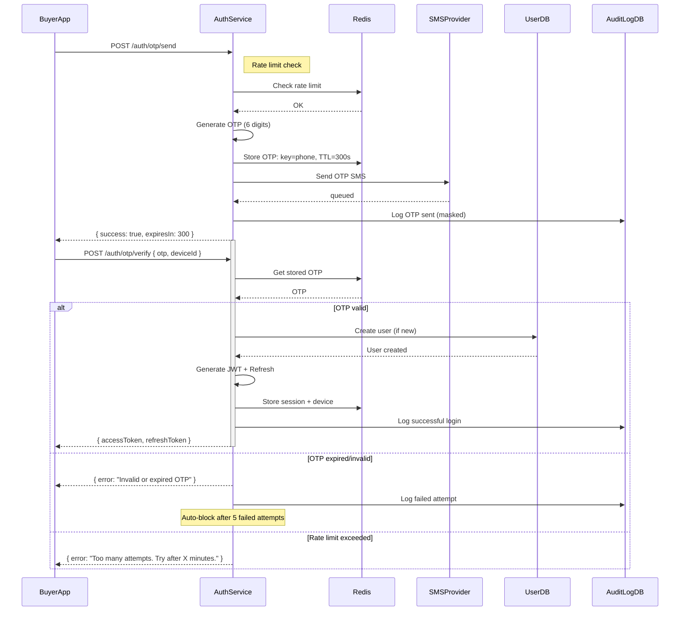

**Failure Flows:**
- OTP expired → "Resend OTP" button available
- Invalid OTP → Show error, allow 5 retries
- Rate limit → Show countdown timer
- SMS delivery failed → Retry via SMS, fallback to voice

**Retry Logic:**
```
OTP Expired: User clicks "Resend" → new OTP generated
SMS Failed: Retry 3 times (exponential 2s), fallback to voice OTP
```

**Compensation:**
- None needed (idempotent operation)

**Events Emitted:**
```
OTP_SENT { userId, phone, timestamp }
OTP_VERIFIED { userId, phone, timestamp }
LOGIN_FAILED { phone, reason, ip, timestamp }
```

**DB Transactions:**
```
TRANSACTION (verify):
  1. Upsert user (if new)
  2. Create LoginSession
  3. Write AuditLog
```

**Cache Strategy:**
```
READ: OTP from Redis (TTL 300s)
WRITE: Store OTP in Redis (TTL 300s)
INVALIDATE: Auto-expire, remove on verify
```

**Security Checks:**
- Rate limit by phone (3/5min)
- Rate limit by IP (5/5min)
- Device binding (fingerprint hash)
- Suspicious login detection (different city/IP)

**Performance Expectations:**
```
OTP Send:     <200ms
OTP Verify:   <100ms
SMS Delivery: <5s (async)
```

**Metrics:**
```
auth_otp_sent_total
auth_otp_verified_total
auth_otp_failed_total { reason }
auth_sms_delivery_time_seconds
```

---

### 1.2 Refresh Token Flow

**Purpose:** Obtain new access token without re-login

**Trigger:**
- Access token expired (401)
- App background refresh

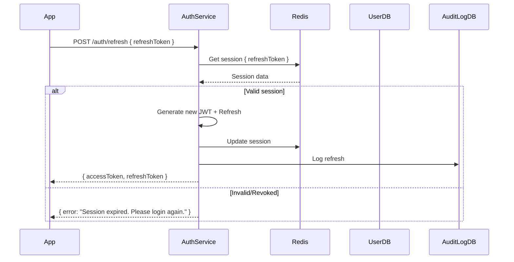

**Failure Flows:**
- Refresh token expired → Force re-login
- Refresh token stolen → Revoke all sessions, notify user
- Concurrent refresh race → Lock + single refresh

**Compensation:**
- Invalidate old tokens (security)
- Notify user of new login (suspicious)

**Events:**
```
TOKEN_REFRESHED { userId, deviceId, timestamp }
SESSION_REVOKED { userId, reason, timestamp }
```

---

## 2. USER & BUSINESS WORKFLOWS

### 2.1 User Onboarding

**Purpose:** Register new buyer/seller with business context

**Actors:**
- `BuyerApp`
- `AuthService`
- `UserService`
- `BusinessService`
- `VerificationService`
- `NotificationWorker`
- `UserDB`
- `BusinessDB`

**Trigger:**
- New user OTP verified
- User clicks "Complete Profile"

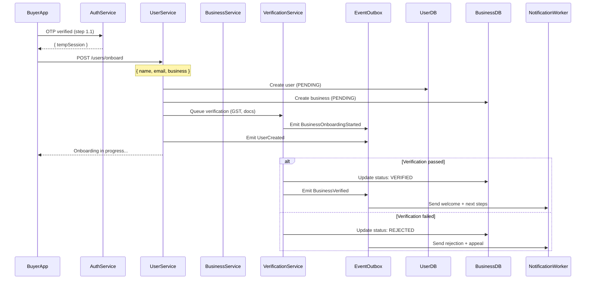

**Failure Flows:**
- GST invalid → Reject, allow re-upload
- Document unclear → Request re-upload (max 3 times)
- Timeout (7 days) → Auto-reject, notify

**Compensation:**
- If user cancels onboarding → Soft delete business, keep user
- If verification fails → Allow re-submission

**Events:**
```
USER_CREATED { userId, phone, timestamp }
BUSINESS_CREATED { businessId, userId, type }
BUSINESS_VERIFIED { businessId, timestamp }
BUSINESS_REJECTED { businessId, reason }
```

**Security Checks:**
- Document authenticity (future: AI)
- Phone number verified
- Rate limit (max 3 onboarding attempts/day)

**Metrics:**
```
onboarding_started_total
onboarding_completed_total
onboarding_rejected_total { reason }
verification_time_seconds
```

---

## 3. PRODUCT WORKFLOWS

### 3.1 Product Listing Creation

**Purpose:** Seller lists a new product

**Actors:**
- `SellerApp`
- `ProductService`
- `ApprovalQueue` (for new sellers)
- `ImageProcessor` (resize, WebP)
- `SearchIndexer`
- `ProductDB`
- `EventOutbox`

**Preconditions:**
- Seller is VERIFIED
- Seller has role: SELLER or SELLER_MANAGER

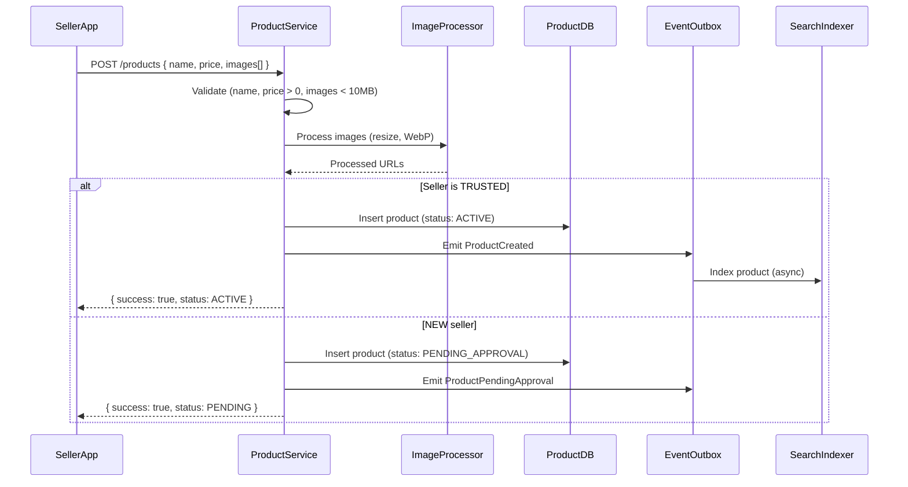

**Failure Flows:**
- Image too large → Reject with size limits
- Invalid category → Suggest corrections
- Duplicate SKU → Reject with conflict

**Compensation:**
- If approval rejected → Soft delete, notify seller
- If seller cancels → Delete draft

**Events:**
```
PRODUCT_CREATED { productId, sellerId, timestamp }
PRODUCT_PENDING_APPROVAL { productId, timestamp }
PRODUCT_APPROVED { productId, approver, timestamp }
PRODUCT_REJECTED { productId, reason }
```

**Metrics:**
```
product_listing_created_total
product_listing_approved_total
product_listing_rejected_total { reason }
image_processing_time_seconds
```

---

## 4. SEARCH WORKFLOWS

### 4.1 Search Query Processing

**Purpose:** Handle product search with filters and ranking

**Actors:**
- `BuyerApp`
- `SearchAPI`
- `Cache` (Redis)
- `SearchDB` (PostgreSQL GIN/OpenSearch future)
- `AnalyticsQueue`

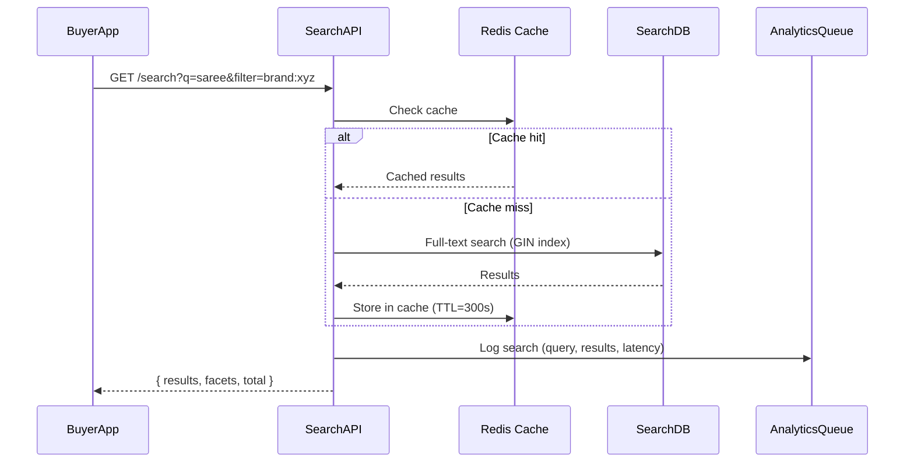

**Failure Flows:**
- DB timeout → Return stale cache (if any)
- No results → Suggest alternatives, log for analytics
- Malicious query → Rate limit, log anomaly

**Cache Strategy:**
```
READ: Check Redis (key=query_hash)
WRITE: Cache results (TTL 5 min)
INVALIDATE: On product update, category change
```

**Metrics:**
```
search_query_total
search_cache_hit_rate
search_latency_seconds
search_zero_results_total
```

---

## 5. INVENTORY WORKFLOWS

### 5.1 Stock Reservation (CRITICAL)

**Purpose:** Reserve stock for order, preventing oversell

**Actors:**
- `OrderService`
- `InventoryService`
- `ReservationDB`
- `ProductDB`
- `Redis` (reservation lock)
- `EventOutbox`
- `NotificationQueue`

**Preconditions:**
- Product exists
- Stock > 0
- Seller status = ACTIVE

```mermaid
sequenceDiagram
    participant O as OrderService
    participant I as InventoryService
    participant R as Redis (Lock)
    participant DB as ProductDB
    participant Q as EventOutbox

    O->>I: REQUEST reserve { productId, qty, orderId }
    I->>R: Acquire lock (productId, TTL=30s)
    alt Lock acquired
        rect rgb(245,245,245)
        Note over I,DB: Reservation Phase
        I->>DB: SELECT stock, version FROM inventory WHERE id=?
        DB-->>I: { stock: 100, version: 5 }
        alt stock >= qty
            I->>DB: UPDATE inventory SET stock = stock - ?, version = version + 1 WHERE id = ? AND version = 5
            alt Update successful
                I->>R: Store reservation { orderId, productId, qty, expiry=900s }
                I->>Q: Emit InventoryReserved
                I-->>O: { success: true, reservationId }
            else Concurrent update (version mismatch)
                I->>R: Release lock
                I-->>O: { error: "Concurrent stock update. Retry." }
            end
        else stock < qty
            I->>DB: SELECT reserved FROM order_reservations WHERE productId=? AND status=PENDING
            DB-->>I: reservedQty
            alt stock + reservedReleasedSoon >= qty
                I-->>O: { warning: "Low stock. Order may be delayed." }
            else
                I-->>O: { error: "Out of stock" }
            end
        end
    else Lock failed
        I-->>O: { error: "Product is being updated. Please retry." }
    end
```

**Failure Flows:**
- Lock timeout → Retry 3 times, then fail
- DB deadlocked → Retry with exponential backoff
- Insufficient stock → Suggest alternatives, notify seller

**Retry Logic:**
```
STOCK_CHECK:    Max 3 retries, 100ms delay
RESERVATION:    Max 3 retries, 200ms delay
LOCK_TIMEOUT:   Retry once, then fail fast
```

**Compensation:**
```
If order cancelled → Release reservation, increment stock
If reservation expired → Auto-release stock
If payment failed → Release reservation (async)
```

**Events:**
```
INVENTORY_RESERVED { productId, orderId, qty, timestamp }
INVENTORY_RELEASED { productId, orderId, reason, timestamp }
INVENTORY_LOW { productId, threshold, timestamp }
```

**Security Checks:**
- Verify order ownership
- Rate limit (max 10 reservations/min)
- Validate product belongs to active seller

**Performance Expectations:**
```
Lock acquisition:    <20ms
Stock update:        <50ms
Total reservation:   <100ms (P99)
```

**Metrics:**
```
inventory_reservation_total
inventory_reservation_failed_total { reason }
inventory_reservation_latency_seconds
inventory_oversell_prevented_total
```

---

## 6. CART & CHECKOUT WORKFLOWS

### 6.1 Cart Creation & Management

**Purpose:** Manage buyer's procurement cart

**Actors:**
- `BuyerApp`
- `CartService`
- `ProductService`
- `InventoryService`
- `CartDB`
- `Redis` (session cache)

**Preconditions:**
- User is authenticated
- Product exists and is ACTIVE

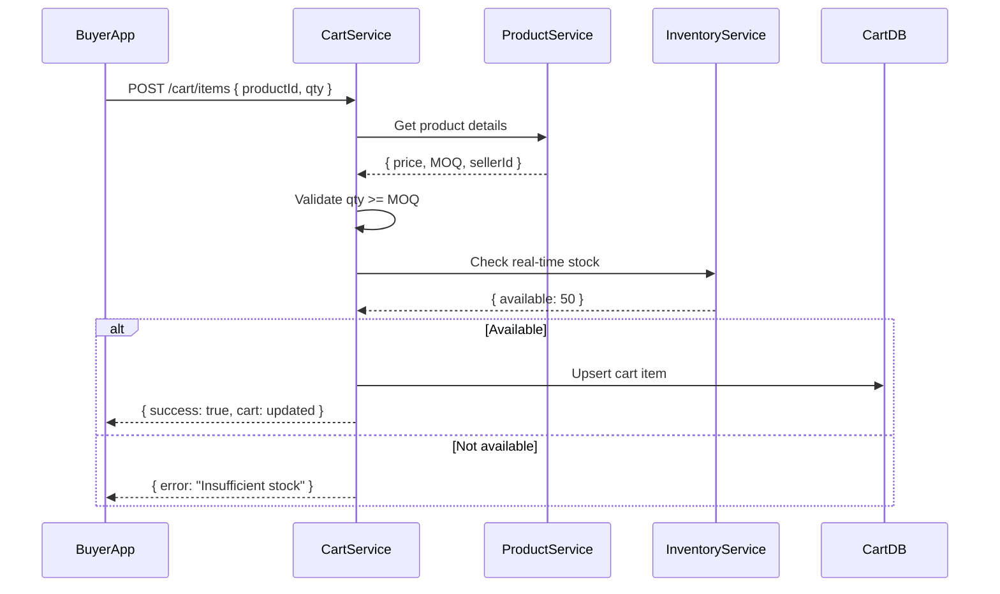

**Failure Flows:**
- MOQ not met → Show error with required MOQ
- Product discontinued → Remove from cart, notify
- Stock changed → Update cart, show warning

**Events:**
```
CART_UPDATED { userId, items, timestamp }
CART_ABANDONED { userId, items, duration }
```

---

## 7. ORDER WORKFLOWS

### 7.1 Order Placement (COMPLETE FLOW)

**Purpose:** Place an order with inventory, payment, and notifications

**Actors:**
- `BuyerApp`
- `OrderService`
- `InventoryService`
- `PaymentService`
- `NotificationWorker`
- `OrderDB`
- `EventOutbox`
- `AuditLogDB`

**Preconditions:**
- Cart is valid (items, quantities)
- Buyer is authenticated
- Delivery address is valid
- Payment method selected

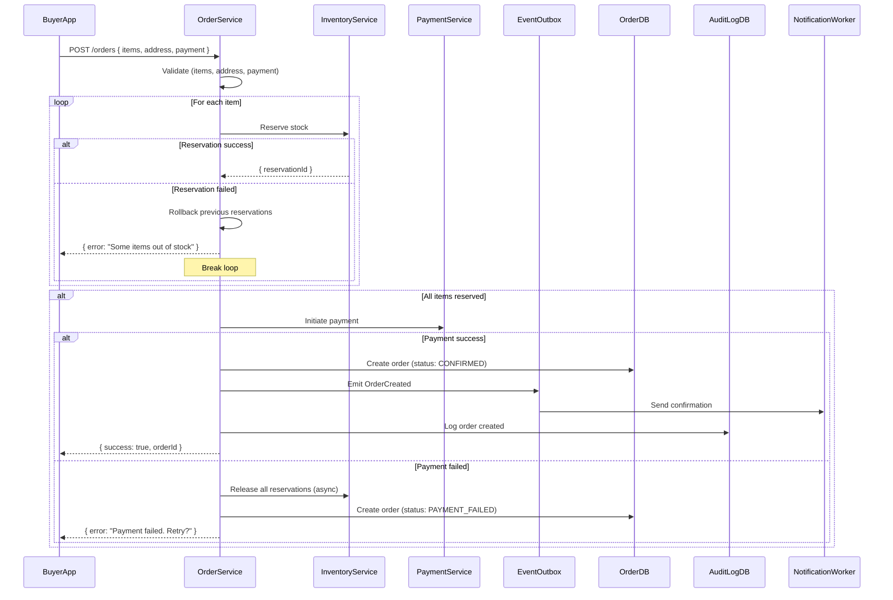

**Failure Flows:**
- Stock unavailable → Suggest alternatives, release reservations
- Payment timeout → Auto-retry once, then cancel
- Partial stock → Allow partial order (if configured)
- Network error → Queue for retry, show "Processing"

**Compensation:**
```
If payment fails → Release stock, notify buyer
If order cancelled → Release stock, refund payment
If seller rejects → Refund, notify buyer
```

**Events:**
```
ORDER_CREATED { orderId, buyerId, amount, timestamp }
ORDER_CONFIRMED { orderId, paymentId, timestamp }
ORDER_PAYMENT_FAILED { orderId, reason, timestamp }
ORDER_CANCELLED { orderId, reason, timestamp }
```

**Metrics:**
```
order_created_total
order_confirmed_total
order_payment_failed_total { reason }
order_placement_latency_seconds
```

---

## 8. PAYMENT WORKFLOWS

### 8.1 Payment Initiation & Webhook

**Purpose:** Process payment with idempotency and reconciliation

**Actors:**
- `OrderService`
- `PaymentService`
- `RazorpayGateway`
- `WebhookHandler`
- `PaymentDB`
- `EventOutbox`

**Preconditions:**
- Order exists and is CONFIRMED
- Idempotency key provided
- Amount > 0

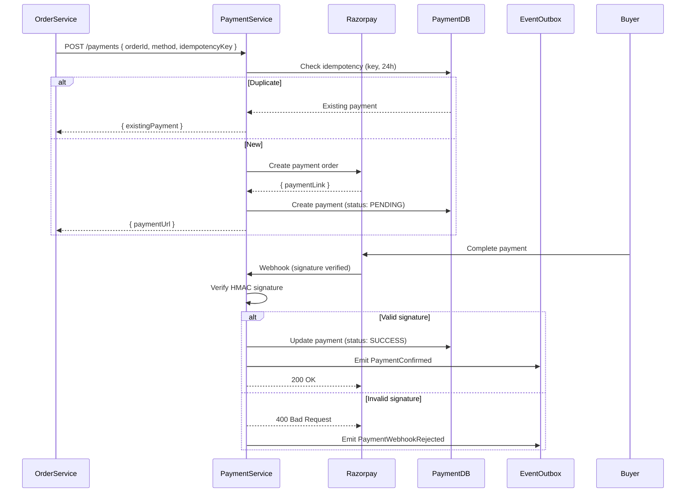

**Failure Flows:**
- Gateway timeout → Retry 3 times, then mark as PENDING_REVIEW
- Webhook lost → Poll status after 5 minutes
- Signature mismatch → Reject, alert security
- Duplicate webhook → Idempotency check (return 200)

**Compensation:**
```
If payment success but order cancelled → Refund (async)
If webhook missed → Manual reconciliation cron
If double charge → Auto-refund (idempotency)
```

**Events:**
```
PAYMENT_INITIATED { paymentId, orderId, amount }
PAYMENT_CONFIRMED { paymentId, gatewayId, timestamp }
PAYMENT_FAILED { paymentId, reason, timestamp }
PAYMENT_WEBHOOK_RECEIVED { paymentId, signature, timestamp }
```

---

## 9. PROCUREMENT WORKFLOWS

### 9.1 RFQ Creation & Response

**Purpose:** Buyer requests quotes from multiple sellers

**Actors:**
- `BuyerApp`
- `SellerApp`
- `ProcurementService`
- `RFQDB`
- `NotificationQueue`

**Preconditions:**
- Buyer is VERIFIED
- Products/categories specified
- Delivery date provided

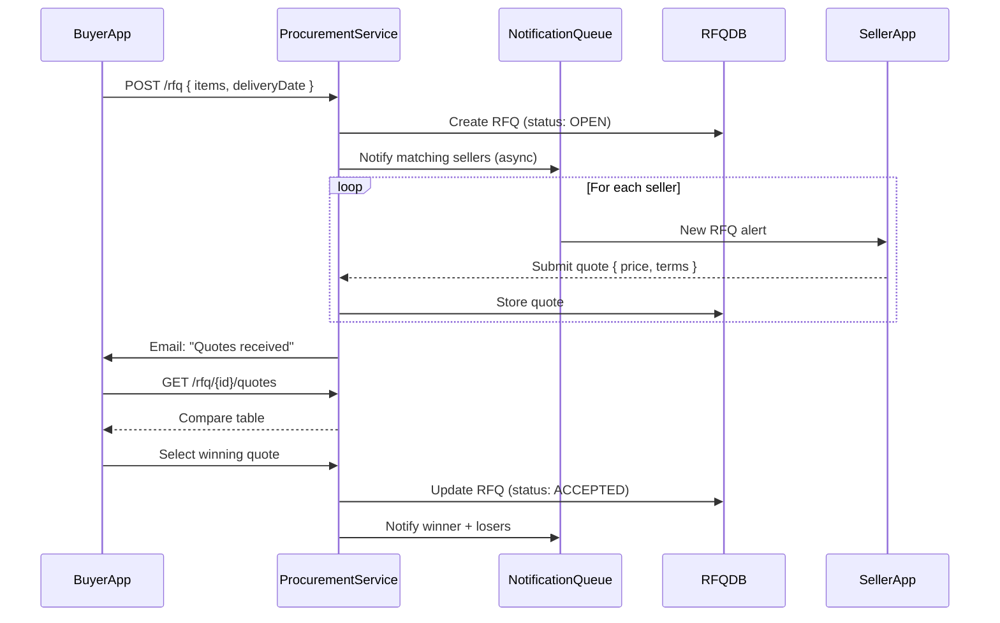

**Events:**
```
RFQ_CREATED { rfqId, buyerId, timestamp }
QUOTE_RECEIVED { rfqId, sellerId, amount }
RFQ_ACCEPTED { rfqId, winningSellerId }
RFQ_EXPIRED { rfqId, timestamp }
```

---

## 10. NOTIFICATION WORKFLOWS

### 10.1 Notification Enqueue & Delivery

**Purpose:** Reliable multi-channel notification delivery

**Actors:**
- `EventOutbox`
- `NotificationWorker`
- `SMSProvider`
- `PushProvider` (FCM)
- `EmailProvider`
- `NotificationDB`

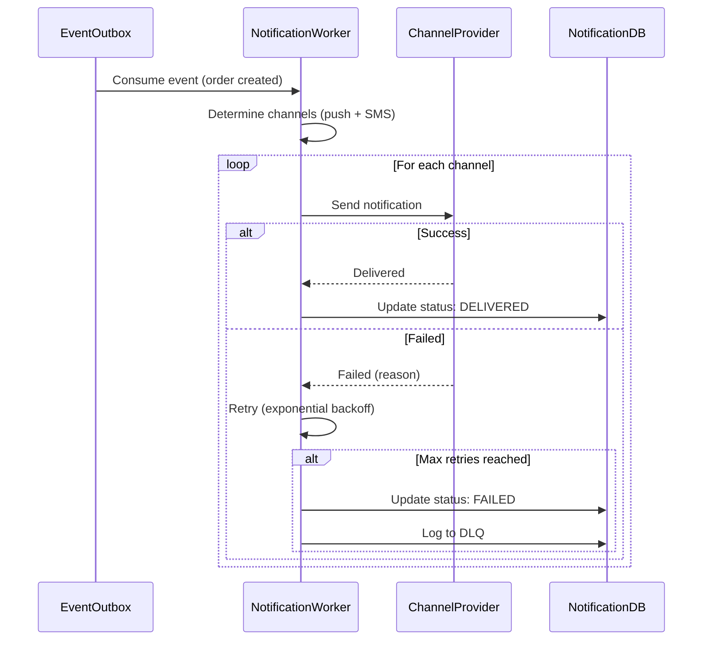

**Failure Flows:**
- Channel down → Retry 5 times, fallback to next channel
- Invalid token → Mark user for re-registration
- Rate limited → Queue for later

**Events:**
```
NOTIFICATION_SENT { userId, channel, status }
NOTIFICATION_FAILED { userId, channel, reason }
```

---

## 11. OPERATOR WORKFLOWS

### 11.1 QC Upload & Sync

**Purpose:** Field operators perform QC and sync when online

**Actors:**
- `FieldOperatorApp`
- `SyncService`
- `S3` (file storage)
- `QCDB`
- `ProductService`

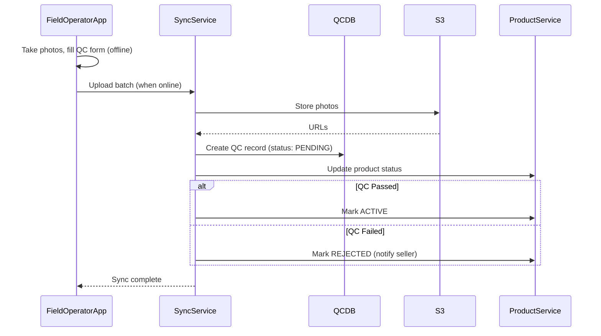

**Failure Flows:**
- Upload interrupted → Resume from last (multipart)
- Invalid photo → Re-request
- Network lost → Queue for retry

**Events:**
```
QC_UPLOADED { operatorId, productId, status }
QC_APPROVED {productId, operatorId }
QC_REJECTED { productId, operatorId, reason }
```

---

## 12. ADMIN WORKFLOWS

### 12.1 Supplier Suspension

**Purpose:** Admin suspends fraudulent/low-quality supplier

**Actors:**
- `AdminDashboard`
- `AdminService`
- `UserDB`
- `ProductDB` (cascade)
- `NotificationQueue`

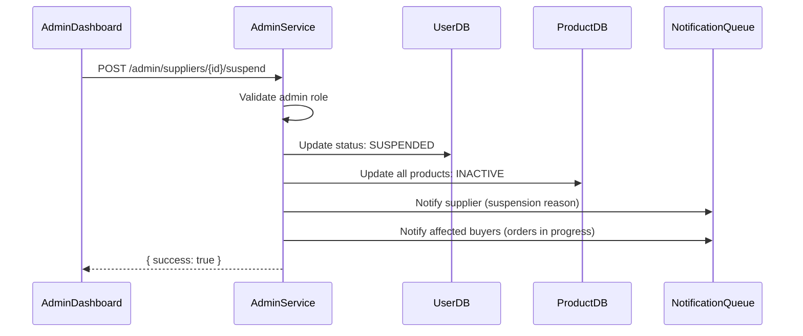

**Events:**
```
SELLER_SUSPENDED { sellerId, reason, adminId }
PRODUCTS_DEACTIVATED { sellerId, count, timestamp }
```

---

## 13. QUEUE & EVENT WORKFLOWS

### 13.1 Event Publish & Consume

**Purpose:** Reliable event-driven communication

**Actors:**
- `Producer` (any service)
- `EventOutbox`
- `EventBus` (BullMQ)
- `Consumer` (any service)
- `DeadLetterQueue`

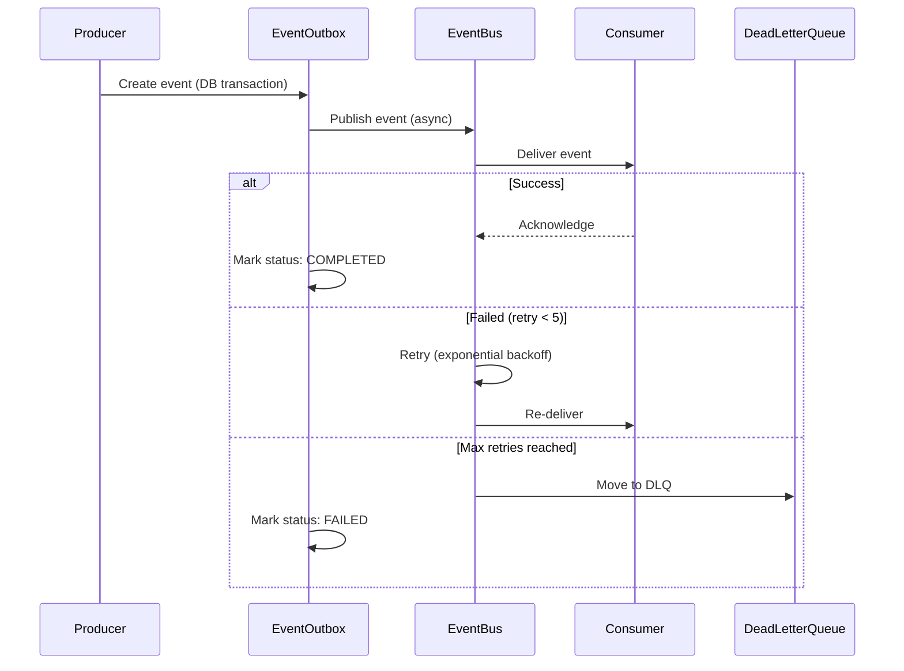

**Compensation:**
- If event lost → Outbox worker replays undelivered events
- If consumer stuck → Alert + manual intervention

**Events:**
```
EVENT_PUBLISHED { eventId, type, timestamp }
EVENT_DELIVERED { eventId, consumer, timestamp }
EVENT_FAILED { eventId, consumer, reason }
EVENT_DLQ { eventId, reason, timestamp }
```

---

## 14. OBSERVABILITY WORKFLOWS

### 14.1 Log Flow

**Purpose:** Centralized logging for debugging

```
APP (Structured JSON) → Fluentd/Vector → Loki/Elasticsearch → Grafana
```

**Metrics Flow:**
```
APP → Prometheus → Grafana (dashboards)
```

**Alert Flow:**
```
Prometheus → AlertManager → Slack/PagerDuty (on-call)
```

---

## 15. DISASTER & RECOVERY WORKFLOWS

### 15.1 DB Failover

**Purpose:** Automatic failover on primary DB failure

```mermaid
sequenceDiagram
    participant App as Application
    participant P as PrimaryDB
    participant S as StandbyDB
    participant H as HealthCheck
    participant Alert as AlertManager

    H->>P: Health check (every 5s)
    alt Primary DB down
        H->>H: Confirm (3 consecutive failures)
        H->>App: Switch to StandbyDB
        H->>Alert: CRITICAL: DB failover initiated
    else Primary DB recovered
        H->>H: Confirm (healthy for 60s)
        H->>App: Return to PrimaryDB
```

---

## 16. FRAUD DETECTION WORKFLOWS

### 16.1 Order Fraud Detection

**Purpose:** Detect and block suspicious orders

**Actors:**
- `OrderService`
- `FraudDetector`
- `RiskScoringAPI`
- `AdminDashboard`

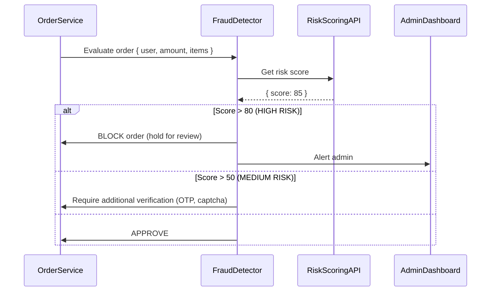

**Events:**
```
ORDER_FLAGGED { orderId, riskScore, reason }
ORDER_BLOCKED { orderId, reason }
ORDER_APPROVED_AFTER_REVIEW { orderId, reviewerId }
```

---

## 17. DATA MIGRATION & ROLLBACK WORKFLOWS

### 17.1 Schema Migration

**Purpose:** Safe database schema evolution

```
1. Write migration (up/down)
2. Test on staging
3. Deploy (maintenance window)
4. Run migration (prisma migrate deploy)
5. Verify (health checks)
6. If failed: Rollback (prisma migrate down)
```

**Rollback Plan:**
```
- Always keep previous Docker image tag
- DB backups before migration (automated)
- Down migration script tested
- If unrecoverable: Restore from backup (last resort)
```

---

## 18. FEATURE FLAG ROLLOUT WORKFLOWS

### 18.1 Gradual Rollout

**Purpose:** Safe feature deployment

```
Phase 1: Internal testing (employees only)
Phase 2: Beta users (5%)
Phase 3: 25% users
Phase 4: 50% users
Phase 5: 100% users (default ON)
```

**Rollback:**
```
If error rate > 0.1% → Auto-disable flag
If manual alert → Toggle off immediately
```

---

## 19. MULTI-TENANT ONBOARDING WORKFLOWS

### 19.1 Tenant Registration

**Purpose:** Onboard new business segments or communities

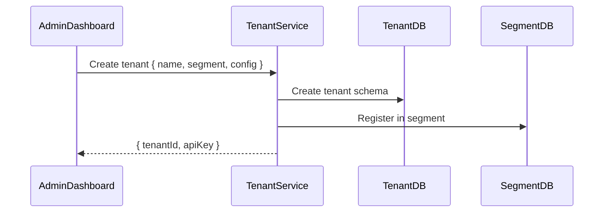

**Isolation:**
```
- Schema-per-tenant (logical isolation)
- Row-level security (RLS)
- Separate Redis namespace
```

---

## 20. GDPR & COMPLIANCE WORKFLOWS

### 20.1 Data Deletion Request

**Purpose:** Handle GDPR "Right to be forgotten"

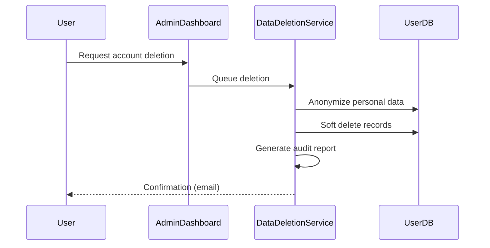

**Retention:**
```
- Financial records: 7 years (legal requirement)
- Personal data: Deleted immediately
- Anonymized analytics: Retained
```

---

## 21. SAGA ORCHESTRATION STRATEGY

**Purpose:** Define saga orchestration for distributed transactions (future-proofing)

**Current (Modular Monolith):**
```
Order Placement:
  1. Reserve Inventory (DB transaction)
  2. Create Order (DB transaction)
  3. Initiate Payment (DB transaction)
  4. Emit OrderCreated (outbox pattern)
```

**Future (Microservices / Event-Driven):**
```
Order Saga (Orchestrated):
  OrderService -> InventoryService: ReserveStock
  OrderService -> PaymentService: ChargePayment
  OrderService -> NotificationService: SendConfirmation
  
  If ANY step fails:
    OrderService -> InventoryService: ReleaseStock (compensate)
    OrderService -> PaymentService: RefundPayment (compensate)
```

**Compensation Rules:**
```
RESERVE_STOCK:    Release stock
CHARGE_PAYMENT:   Refund payment
SEND_EMAIL:       No action needed (idempotent)
```

**Mermaid Orchestration Diagram:**
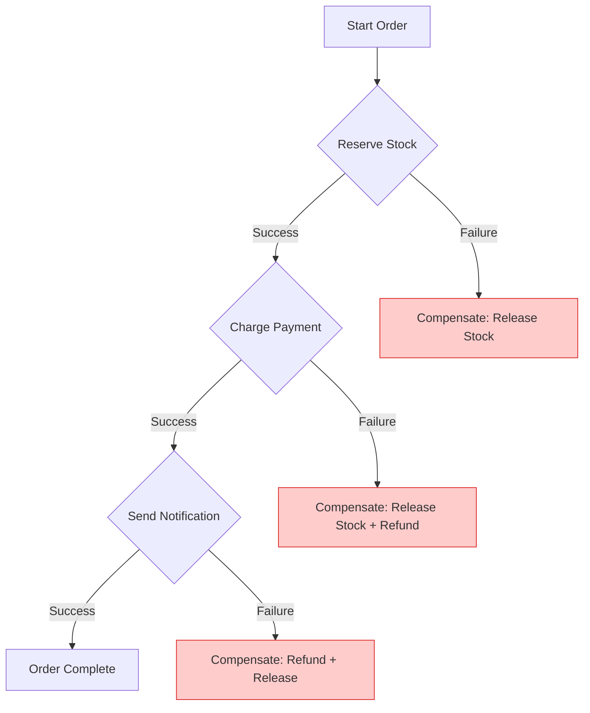

**Event-Driven (Choreographed):**
```
OrderCreated -> InventoryService (listens)
InventoryReserved -> PaymentService (listens)
PaymentConfirmed -> NotificationService (listens)
```

---

## 22. EVENT VERSIONING STRATEGY

**Purpose:** Future-proof event schema evolution

**Rules:**
```
EVENT SCHEMA:
  {
    "eventType": "OrderCreated",
    "eventVersion": 2,
    "timestamp": "2025-05-22T10:00:00Z",
    "payload": { ... }
  }

VERSIONING RULES:
  - Increment MAJOR for breaking changes
  - Increment MINOR for backward-compatible additions
  - Default version: 1 (if not specified)

CONSUMER RULES:
  - Accept all versions >= minSupportedVersion
  - Ignore unknown fields (forward compatibility)
  - Default missing fields to sensible values

DEPRECATED EVENTS:
  - Marked as DEPRECATED (not removed for 6 months)
  - Dual-publish old + new version during migration
  - Alert logs when deprecated events consumed
```

---

## 23. IDEMPOTENCY STORAGE STRATEGY

**Purpose:** Prevent duplicate operations (payments, orders, reservations)

**Implementation:**
```
KEY GENERATION:
  - Client generates UUID
  - Key stored in Redis (TTL: 24 hours)
  - Key: "idempotency:{key}_{action}"

STORAGE RULES:
  - Key: hash(clientId + action + resource)
  - TTL: 24 hours (configurable per endpoint)
  - Replay protection: Return cached response for same key

EXAMPLE (Payment):
  1. Client sends: POST /payments { idempotencyKey: "abc-123", ... }
  2. Server checks: Redis GET "idempotency:abc-123_payment"
  3. If exists: Return cached response (201)
  4. If new: Process, store response, return (200)
```

---

## 24. QUEUE PRIORITY STRATEGY

**Purpose:** Ensure critical operations are never blocked

| Queue | Priority | Latency Target | Max Depth |
|-------|----------|---------------|-----------|
| **Payment** | Critical | <1s | 1000 |
| **Inventory** | Critical | <1s | 500 |
| **Order** | High | <2s | 2000 |
| **Notification** | Medium | <5s | 5000 |
| **Email** | Medium | <30s | 10000 |
| **Analytics** | Low | <60s | 50000 |
| **Search Reindex** | Low | <5min | 100000 |

**BullMQ Priority Configuration:**
```
await queue.add('process-payment', data, { priority: 1 });   // Critical
await queue.add('reduce-stock', data, { priority: 2 });    // Critical
await queue.add('send-email', data, { priority: 5 });       // Medium
```

---

## 25. CIRCUIT BREAKER STRATEGY

**Purpose:** Prevent cascading failures across services

**Implementation:**
```
STATES:
  CLOSED  -> Normal operation
  OPEN    -> Failing fast (all requests blocked)
  HALF-OPEN -> Testing if service recovered

RULES:
  - Failure threshold: 5 errors in 60 seconds
  - Open duration: 30 seconds
  - Half-open requests: 1 per 10 seconds
  - Success threshold to close: 3 consecutive

EXAMPLE (Payment Gateway):
  - If Razorpay fails 5 times in 60s → OPEN
  - All payment requests return: "Payment unavailable. Try COD."
  - After 30s → HALF-OPEN (allow 1 request)
  - If success → CLOSED (normal)
  - If failure → OPEN again
```

**Mermaid Circuit Breaker:**
```mermaid
stateDiagram-v2
    [*] --> CLOSED : Start
    CLOSED --> OPEN : Failure
    OPEN --> HALF_OPEN : Timeout
    HALF_OPEN --> CLOSED : Success
    HALF_OPEN --> OPEN : Failure
    OPEN --> CLOSED : Manual reset
```

---

## 26. BULK OPERATION WORKFLOWS

**Purpose:** Handle B2B bulk operations efficiently

**Bulk Product Upload:**
```
1. Client uploads CSV (max 10,000 rows)
2. Server queues for async processing
3. Worker validates each row
4. Valid rows inserted (batch 100)
5. Invalid rows logged to error file
6. Email summary to seller
```

**Bulk Inventory Update:**
```
1. Client uploads CSV (productId, newStock, newPrice)
2. Server queues for async processing
3. Worker updates each product (with locking)
4. Events emitted per product update
5. Summary report generated
```

**Mermaid Bulk Workflow:**
```mermaid
sequenceDiagram
    participant C as Client
    participant S as Server
    participant Q as Queue
    participant W as Worker
    participant DB as Database
    participant E as EventBus

    C->>S: Upload CSV (10,000 rows)
    S->>Q: Queue batch job
    S-->>C: Job ID: processing
    
    loop For each batch (100 rows)
        Q->>W: Process batch
        W->>DB: Update (batch)
        W->>E: Emit events
        W->>W: Log progress
    end
    
    W->>S: Job complete
    S-->>C: Email: summary + errors
```

---

## 27. DEGRADED MODE STRATEGY

**Purpose:** Core commerce continues even when non-essential services fail

**Critical Path (Must Work):**
```
✅ Search products
✅ View product details
✅ Add to cart
✅ Place order
✅ Payment (COD fallback)
```

**Degraded Features (Graceful Failure):**
```
❌ Search suggestions → Basic search still works
❌ Real-time stock → Show last known stock (stale, but functional)
❌ Notifications → Queue for later
❌ Analytics → Skip (no impact)
❌ Recommendations → Skip, show trending
❌ Reviews → Skip
```

**UX During Degraded Mode:**
```
BANNER: "Some features are temporarily unavailable. Core shopping works fine."
INDICATOR: "Stock may be outdated. Check with seller before ordering."
```

---

## 28. AUTHENTICATION RECOVERY & SUPPORT ESCALATION

**Purpose:** Help users recover from login failures

**Actors:**
- `User`
- `AuthService`
- `FraudDetector`
- `SupportTicketService` (auto-creates recovery tickets)
- `SupportDashboard`
- `SupportAgent`

**Trigger:**
- 5 failed OTP attempts
- Rate limit exceeded (3 OTPs/5min)
- Device mismatch detected

**Preconditions:**
- User previously verified phone
- Login history exists in DB

**Mermaid Recovery Flow:
```mermaid
sequenceDiagram
    participant U as User
    participant A as AuthService
    participant F as FraudDetector
    participant S as SupportTicketService
    participant D as SupportDashboard
    participant Ag as SupportAgent

    U->>A: OTP failed (5th attempt)
    A->>F: Check risk score
    F-->>A: Risk: Medium
    A-->>U: Account temporarily locked
    
    U->>A: Click "Need Help?"
    A->>S: Create recovery ticket
    S->>S: Attach: phone, device, IP, timestamps
    S->>D: Show in dashboard
    
    D->>Ag: Alert: High failed attempts
    Ag->>D: Review details
    Ag->>A: Reset rate limit (after verification)
    A-->>U: Login allowed. Retry now.
```

**Support Dashboard Fields:**
```
- User phone (masked)
- Failure reason (rate limit / expired OTP / device blocked)
- Failed attempts (count)
- Device mismatch (yes/no)
- SMS delivery (success/failed)
- Risk score (low/medium/high)
- Last successful login
- Suggested action
```

---


---

### 28.1 AUTH RECOVERY UX LOCKOUT DETAIL

**Purpose:** Define lockout UX, support escalation, and recovery protocols

**Rules:**
```
WHEN LOGIN BLOCK TRIGGERED:
  1. User sees clear lockout message
  2. Countdown timer visible
  3. Support CTA shown
  4. Auto-ticket creation on support click
  5. Support dashboard instant visibility
```

**Lockout UX Block:**
```
========================================================================
TEMPORARILY LOCKED
========================================================================

For your security, login has been paused.

Lock duration: 15 minutes
Remaining: 14:32

Reason:
  • 5 failed login attempts detected

Possible reasons:
  • Multiple incorrect OTP attempts
  • Excessive retry requests
  • Suspicious login behavior

[Retry after: 14:32]  (disabled)
[Contact Support]

========================================================================
```

**Support Dashboard Auto-Ticket:**
```
Auto-created when user clicks 

Fields automatically attached:
  - User phone (masked)
  - Device ID (hashed)
  - IP hash
  - Retry count (5)
  - Failure reason (OTP/Rate limit)
  - Risk score (Medium/High)
  - Last successful login
  - Suggested action (reset rate limit / unblock)

Visibility: Support dashboard immediate refresh
```

**Lockout Governance:**
```
LOCK RULE:     Auto-lock after 5 failed attempts (10 minute window)
DURATION:      15 minutes (adjustable)
COOLDOWN:      Disable OTP resend during lockout period
RETRY RULE:    Auto-unlock after 15 minutes with exponential cooldown
SUPPORT:       Support override available (requires verification)
MAX LOCKOUT:   3 times per day (before escalation to manual review)
```
## 29. BACKPRESSURE STRATEGY

**Purpose:** Prevent system overload during traffic spikes

**Rules:**
```
SCENARIO: Queue depth > 10,000
  - Auto-scale workers (if K8s)
  - Shed analytics jobs (low priority)
  - Return "503 Service Unavailable" for non-critical APIs
  - Enable degraded mode

SCENARIO: DB CPU > 90%
  - Enable read replicas (if configured)
  - Cache more aggressively
  - Defer non-critical writes
  - Alert ops team

SCENARIO: Redis memory > 85%
  - Evict old analytics cache
  - Reduce TTL on non-critical keys
  - Alert ops team
```

---

## 30. SECURITY INCIDENT WORKFLOWS

**Purpose:** Respond to security incidents

**Suspicious Login:**
```
1. Detect: Login from new city/device
2. Alert: Email + SMS to user
3. Require: Additional OTP verification
4. Log: Audit trail
5. If user confirms: Allow, update trust
6. If user denies: Block device, force password change
```

**Token Compromise:**
```
1. Detect: Token used from unauthorized device
2. Action: Revoke all sessions immediately
3. Notify: User (email + SMS)
4. Require: Re-login with OTP
5. Log: Security incident
```

---

## 31. SEARCH INDEX REBUILD FLOW

**Purpose:** Rebuild search index after schema changes, data corruption, or bulk updates

**Actors:**
- `AdminDashboard`
- `SearchAdminService`
- `ProductService`
- `SearchIndexer` (BullMQ Worker)
- `OpenSearch` (future) / PostgreSQL
- `SearchDB`

**Trigger:**
- Weekly cron (Sunday 2 AM)
- Manual admin trigger (schema change)
- Failed indexing alert

**Preconditions:**
- Search backend is healthy
- No active searches during full rebuild
- Backup of current index exists

```mermaid
sequenceDiagram
    participant A as AdminDashboard
    participant S as SearchAdminService
    participant Q as BullMQ Queue
    participant W as SearchIndexer
    participant DB as ProductDB
    participant IDX as OpenSearch

    alt Manual trigger
        A->>S: POST /admin/search/rebuild
    else Cron trigger
        Cron-->>S: Trigger weekly reindex
    end

    S->>S: Validate (no active searches)
    S->>DB: Count total products
    S->>Q: Queue: reindex products (batch 1000)

    loop For each batch
        Q->>W: Process batch
        W->>DB: Fetch product data
        W->>IDX: Bulk index products
        W->>S: Report progress
    end

    alt Index complete
        S->>S: Validate document count matches
        S-->>A: { success: true, indexed: 50000 }
    else Partial failure (>5% docs failed)
        S->>Q: Retry failed documents (DLQ)
        S->>A: Alert: { warning: "Partial failure" }
    else Critical failure
        S->>S: Rollback to previous index
        S-->>A: { error: "Rebuild failed" }
    end
```

**Full Reindex:**
```
1. Lock index (maintenance mode)
2. Create new index (parallel)
3. Bulk index all products (batch 1000)
4. Validate document count
5. Atomic alias swap
6. Unlock index
```

**Events:**
```
SEARCH_REBUILD_STARTED { trigger, timestamp }
SEARCH_REBUILD_PROGRESS { batch, total, timestamp }
SEARCH_REBUILD_COMPLETED { count, duration, timestamp }
SEARCH_REBUILD_FAILED { reason, timestamp }
```

**Metrics:**
```
search_rebuild_total
search_rebuild_duration_seconds { status }
search_indexed_products_total
```

---

## 32. CACHE FAILURE MATRIX

**Purpose:** Handle Redis failures gracefully with minimal impact

**Actors:**
- `API Gateway`
- `Redis`
- `Database`
- `DegradedModeService`

**Triggers:**
- Redis latency >200ms
- Redis connection error
- Redis memory >85%

```mermaid
sequenceDiagram
    participant API as API Gateway
    participant R as Redis
    participant DB as Database
    participant D as DegradedModeService

    API->>R: Request: GET /products

    alt Redis Slow (>200ms)
        R-->>API: Response: slow response
        API->>DB: Fallback: SELECT SQL (without cache)
        DB-->>API: { results }
        API->>API: Alert: WARNING (slow)
    else Redis Down
        R-->>API: Connection error
        API->>D: Enable degraded mode
        API->>DB: Fallback: DB read
        DB-->>API: { stale data, cacheBypass: true }
        API->>API: Alert: CRITICAL
    else Redis Memory >85%
        R-->>API: Memory warning
        API->>R: Evict analytics cache
        API->>API: Alert: WARNING (cleanup)
    end
```

**Cache Failure Matrix:**

| Redis State | System Impact | Fallback Action |
|-------------|---------------|-----------------|
| **Slow (>200ms)** | Read latency spikes | Fallback to DB reads |
| **Down** | All reads fail | Serve stale (5min), degraded mode |
| **Memory >85%** | Eviction risk | Evict analytics first, then search |
| **Connection Error** | None | Retry 3x, fallback to DB |

**Recovery:**
```
Redis back → Invalidate stale keys → Resume normal → Alert resolved
```

---

## 33. WORKER RECOVERY RULES

**Purpose:** Manage stalled workers, orphan jobs, and replay safety

**Actors:**
- `BullMQ Worker`
- `HeartbeatMonitor`
- `OrphanJobCleaner`
- `DeadLetterQueue`
- `BullMQ Scheduler`

**Triggers:**
- Job stuck for 30s
- Worker crash
- Orphan key detected in Redis
- Stalled job alert

```mermaid
sequenceDiagram
    participant Q as BullMQ Queue
    participant W as Worker
    participant H as HeartbeatMonitor
    participant O as OrphanCleaner
    participant DLQ as DeadLetterQueue

    W->>Q: Pick up job
    W->>W: Start processing

    alt Normal
        W->>Q: Mark complete
    else Job stuck >30s
        H->>H: Detected in heartbeat
        H->>Q: Kill job (signal timeout)
        H->>Q: Retry once
        Q->>W: Retry
    else Retry failed
        Q->>DLQ: Move to DLQ
    end

    O->>O: Cron: every hour
    O->>Q: Scan for orphan keys
    alt Orphan job found
        O->>DLQ: Move orphan to DLQ
    end
```

**Rules:**
```
STALLED JOB: Timeout after 30s → Kill + Retry once → DLQ if still fails
HEARTBEAT:    Every 15s (ping queue)
ORPHAN CLEAN: Every hour (cron job)
REPLAY:       Check idempotency key before processing
JOB DLQ:      Max 3 retries, then DLQ → Manual review
```

**Metrics:**
```
worker_stalled_total
worker_orphan_found_total
worker_orphan_cleaned_total
worker_dlq_size
```

---

## 34. UTC TIME RULE

**Purpose:** Ensure consistent time handling across distributed systems

**Actors:**
- `API Gateway`
- `Server`
- `Database`
- `Client` (React app)

**Rules:**
```
STORAGE:  All DB timestamps in UTC (ISO 8601)
CLIENT:   Convert to local timezone at presentation layer
LOGS:     Always in UTC (server-side)
API:      Return UTC, client handles display
SYNC:     ISO 8601 format (YYYY-MM-DDTHH:mm:ssZ)
CRON:     Always in server timezone (UTC)
```

**Clock Drift Monitoring:**
```
NTP Sync: Every 1 hour
Drift Threshold: >50ms → Alert WARNING
Drift Threshold: >500ms → Alert CRITICAL
```

**Events:**
```
CLOCK_DRIFT_DETECTED { serverId, driftMs, timestamp }
NTP_SYNC_FAILED { serverId, timestamp }
```

---

## 35. FILE CLEANUP RULES

**Purpose:** Prevent storage bloat and orphaned uploads

**Actors:**
- `FileCleanupWorker`
- `S3StorageService`
- `MediaDB`

**Trigger:**
- Daily cron at 3 AM

```mermaid
sequenceDiagram
    participant W as FileCleanupWorker
    participant S3 as S3
    participant DB as MediaDB

    W->>W: trigger: 3 AM daily
    W->>S3: List temp uploads (last modified >12h)
    W->>S3: List failed multipart >7 days
    W->>S3: List orphan uploads (no productId)

    loop For each file
        W->>S3: Soft delete (lifecycle)
        W->>DB: Mark as DELETED
    end

    W->>W: Log summary
```

**Cleanup Rules:**
```
TEMP UPLOADS:     Deleted after 12 hours (upload incomplete)
FAILED MULTIPART: Deleted after 7 days (abandoned)
ORPHAN UPLOADS:   Deleted after 24 hours (no productId)
SOFT-DELETED:     Permanently deleted after 30 days
CRON:             Daily at 3 AM IST
```

**Metrics:**
```
file_cleanup_orphan_deleted_total
file_cleanup_temp_deleted_total
file_cleanup_failed_multipart_deleted_total
```

---

## 36. API TIMEOUT GOVERNANCE

**Purpose:** Define strict timeout rules per service to prevent cascading failures

**Actors:**
- `API Gateway`
- `Service` (Inventory/Search/Payment/etc.)
- `Client`

**Policy:**

| Service | Timeout | Retry | Fallback |
|---------|---------|-------|----------|
| **Inventory** | 1s | 1 | Return stale from cache |
| **Search** | 2s | 1 | Simple search (no ranking) |
| **Payment** | 10s | 0 | Return pending, poll later |
| **Notifications** | 5s | 3 | Queue for async retry |
| **Analytics** | 5s | 0 | Skip analytics (no-op) |
| **Auth** | 2s | 1 | Return 503, retry later |

**Note on Extreme Cases:**
```
TIMEOUT_SPIKE:  If any service >100x timeout in 5min window
                → Trigger circuit breaker (open)
                → Alert Ops (CRITICAL)
                → Enable degraded mode
```

**Rules:**
```
TIMEOUT:  Request cancelled if exceeds threshold
RETRY:     Max retry count (0 = never retry)
FALLBACK:  Action when timeout + retry exhausted
ALERT:     Any timeout > threshold → Warning in metrics
CRITICAL:  5 consecutive timeouts → Alert Ops
```

**Mermaid Timeout Flow:**
```mermaid
sequenceDiagram
    participant C as Client
    participant G as API Gateway
    participant S as Service
    participant DB as Database

    C->>G: GET /inventory/:id
    G->>S: Forward request (timeout: 1s)
    alt Response <1s
        S-->>G: { product, stock: 50 }
        G-->>C: 200 OK
    else Timeout (>1s)
        G->>G: Trigger fallback
        G->>DB: Query stale cache (Products table)
        DB-->>G: { lastKnownStock }
        G-->>C: 200 OK (stale:true, retryAfter:5)
        G->>G: Alert: WARNING (timeout)
    end
```

**Events:**
```
API_TIMEOUT { service, endpoint, timeout, timestamp }
API_TIMEOUT_FALLBACK { service, fallbackType, timestamp }
API_TIMEOUT_SPIKE { service, count5min, timestamp }
```

**Metrics:**
```
api_timeout_total { service } gauge
api_timeout_rate { service }
api_timeout_fallback_total { service, fallbackType }
```

---


---

## 37. SESSION CONCURRENCY STRATEGY

**Purpose:** Handle multiple active sessions per user securely

**Rules:**
```
MAX CONCURRENT:    3 sessions per user
DEVICE BINDING:    Required for new devices
GEO RESTRICTION:   Block if new country without verification
SESSION PRIORITY:  Keep 3 most recent, revoke oldest
```

**Flow:**
```mermaid
sequenceDiagram
    participant U as BuyerApp
    participant A as AuthService
    participant R as Redis

    U->>A: Login from new device
    A->>R: Check active sessions
    alt Under 3 sessions
        R-->>A: Session created
    else Max 3 reached
        A->>R: Revoke oldest session
        A-->>U: "Previous device logged out"
    end
```

---

## 38. SUPPORT ACTION AUDIT IMMUTABILITY

**Purpose:** Support actions must be append-only and immutable

**Rule:**
```
Support audit logs are append-only and immutable.
```

**Transaction Log:**
```
Action:   Unlock user account
Reason:   "User verified identity via KYC"
Timestamp: 2025-05-22T10:30:00Z
Agent:    support_agent_007
Result:   SUCCESS
Immutable: YES
```

---

## 39. FEATURE FLAG DEPENDENCY RULES

**Purpose:** Prevent circular dependencies between feature flags

**Rule:**
```
Feature flags cannot depend cyclically.
Validation: CI blocks deployment if cycle detected.
```

**Valid:**
```
FeatureA -> FeatureB -> FeatureC (OK)
```

**Invalid:**
```
FeatureA -> FeatureB -> FeatureA (CYCLE - BLOCKED)
```

---

## 40. MANUAL OPERATION PLAYBOOKS

**Purpose:** Document manual overrides for emergency situations

| Emergency | Procedure |
|-----------|-----------|
| **Manual Refund** | Verify payment record, initiate direct gateway refund |
| **Queue Replay** | Export DLQ, validate, re-queue with new idempotency key |
| **Inventory Correction** | Verify via serial number, update with audit trail |
| **Stock Unlock** | Check orphaned reservations, force release to inventory |

**Template:**
```
Step 1: Verify current state
Step 2: Take screenshot/log before action
Step 3: Execute manual override
Step 4: Log in audit trail
Step 5: Notify stakeholders
```

---

## 41. SEARCH DEGRADATION UX

**Purpose:** Handle search unavailability gracefully

**Fallback:**
```
"Search suggestions temporarily unavailable.
Basic search still active."

Fallback actions:
- Category browsing (static cached)
- Recently viewed products
- Trending products
```

---

## 42. PAYMENT PENDING UX

**Purpose:** Manage user expectations during pending payment

**States:**
```
PENDING:
  Message: "Payment processing. Do not retry yet."
  UI:      Loading spinner
  Action:  Disable retry for 30 seconds

RETRY_ALLOWED:
  Message: "Payment failed. Please retry."
  UI:      Retry button active
```

## OFFICIAL WORKFLOW FREEZE

**This document is the single source of truth for VyaparNet system behavior.**

| Area | Status |
|------|--------|
| Authentication | ✅ Defined |
| Inventory | ✅ Defined (concurrency-safe) |
| Order Placement | ✅ Defined (with payment) |
| Payment | ✅ Defined (webhook + idempotency) |
| Search | ✅ Defined |
| Procurement | ✅ Defined |
| Notifications | ✅ Defined |
| Operator | ✅ Defined |
| Admin | ✅ Defined |
| Queue & Events | ✅ Defined |
| Observability | ✅ Defined |
| Disaster Recovery | ✅ Defined |
| Fraud Detection | ✅ Defined |
| Data Migration | ✅ Defined |
| Feature Flags | ✅ Defined |
| Multi-Tenancy | ✅ Defined |
| GDPR | ✅ Defined |
| Search Rebuild | ✅ Defined |
| Cache Failure | ✅ Defined |
| Worker Recovery | ✅ Defined |
| UTC Time | ✅ Defined |
| File Cleanup | ✅ Defined |
| API Timeouts | ✅ Defined |

| Session Concurrency | ✅ Defined (37) |
| Support Audit Immutability | ✅ Defined (38) |
| Feature Flag Dependency | ✅ Defined (39) |
| Manual Operation Playbooks | ✅ Defined (40) |
| Search Degradation UX | ✅ Defined (41) |
| Payment Pending UX | ✅ Defined (42) |
| Auth Recovery UX Lockout | ✅ Defined (28.1) |
**Version:** v1.3 FINAL FREEZE
**Status:** ENTERPRISE-GRADE PRODUCTION BLUEPRINT

---

**Next Phase: CODE**

**VyaparNet Workflow Architecture is officially frozen and ready for implementation.**
